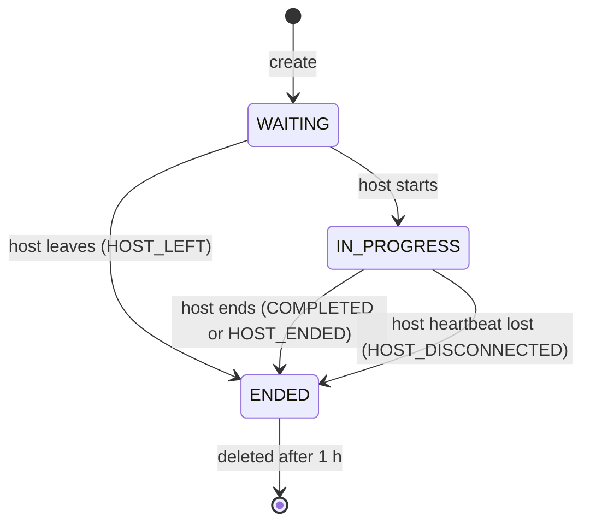

# Lobby service

Rules behind `openapi/lobby.openapi.yaml`. Schemas: `schemas/lobby.schema.json`. Examples:
`examples/lobby/`.

## States

`endReason` is present only in `ENDED`.

## Members

| Rule | Detail |
|---|---|
| Capacity | `maxPlayers` is 5 |
| Slots | The creator is host in slot 0. Joiners take the lowest free slot |
| Names | Trimmed, 1 to 16 characters, unique per lobby ignoring case (`NAME_TAKEN`) |
| Joining | Only while `WAITING` (`LOBBY_NOT_WAITING`) |
| Token | `playerToken` is returned once, in `LobbyMembership`, and never appears in `Lobby` |

## Heartbeat and polling

Clients poll `GET /api/v1/lobbies/{code}` with their `X-Player-Token`. Each authenticated poll
records that player as seen.

| Status | Client polls every | Lobby service does |
|---|---|---|
| `WAITING` | 1 s | Removes a member not seen for 15 s. If that member is the host, the lobby ends with `HOST_LEFT` |
| `IN_PROGRESS` | 5 s | Ends the lobby with `HOST_DISCONNECTED` if the host is not seen for 30 s. Other members are not removed |

## Authorization

| Endpoint | Token |
|---|---|
| Create, join, get session, health | None |
| Get lobby | Optional; when present it counts as a heartbeat |
| Leave | Required. A player can remove itself; the host can remove anyone |
| Start, end | Required, must be the host (`NOT_HOST`) |

A missing token, or one that does not belong to this lobby, is 401 `INVALID_PLAYER_TOKEN`. That
includes polling after being removed for a missed heartbeat: the client shows "You were removed
from the lobby" and returns to the main menu.

## Starting a session

`POST /api/v1/lobbies/{code}/start`:

1. Requires `WAITING` and the host's token.
2. Requires `expectedPlayerIds` to equal the current member list, ignoring order. The host sends
   the members it has open `game` channels to. On a mismatch (someone joined or left since the
   host's last poll) it returns 409 `LOBBY_CHANGED`; the host waits for the next poll and tries
   again.
3. Calls the world service `POST /api/v1/worlds` with body `{}`, with a 5 s timeout. On
   failure returns 502 `WORLD_SERVICE_UNAVAILABLE` and stays `WAITING`.
4. Creates a `sessionId`, records `startedAt` and the current members, and moves to
   `IN_PROGRESS`.
5. Returns `SessionDetails`. The same object is served by `GET .../session` until the lobby is
   deleted.

The lobby service passes the world config through unchanged. It does not read or validate it
beyond JSON parsing, so world config changes never require a lobby service change.

The world service URL is configuration (`WORLD_SERVICE_URL`, default `http://localhost:8083`).

## Error codes

| Status | Code | When |
|---|---|---|
| 400 | `VALIDATION_FAILED` | Body or path fails validation |
| 401 | `INVALID_PLAYER_TOKEN` | Token missing or not a member |
| 403 | `NOT_HOST` | Host-only action by a non-host |
| 403 | `FORBIDDEN` | Removing another player without being host |
| 404 | `LOBBY_NOT_FOUND` | No live lobby with this code |
| 404 | `PLAYER_NOT_FOUND` | Player is not in this lobby |
| 409 | `LOBBY_FULL` | Already 5 members |
| 409 | `LOBBY_NOT_WAITING` | Join or start after the session started or ended |
| 409 | `LOBBY_CHANGED` | Start with `expectedPlayerIds` that differ from the members |
| 409 | `NAME_TAKEN` | Name already used in this lobby |
| 409 | `SESSION_NOT_STARTED` | Get session before start |
| 409 | `SESSION_NOT_IN_PROGRESS` | End when not `IN_PROGRESS` |
| 502 | `WORLD_SERVICE_UNAVAILABLE` | World service failed or timed out |
| 500 | `INTERNAL_ERROR` | Anything unexpected |

## Storage

In memory. Restarting the service drops every lobby. Ended lobbies are deleted 1 hour after
ending.
