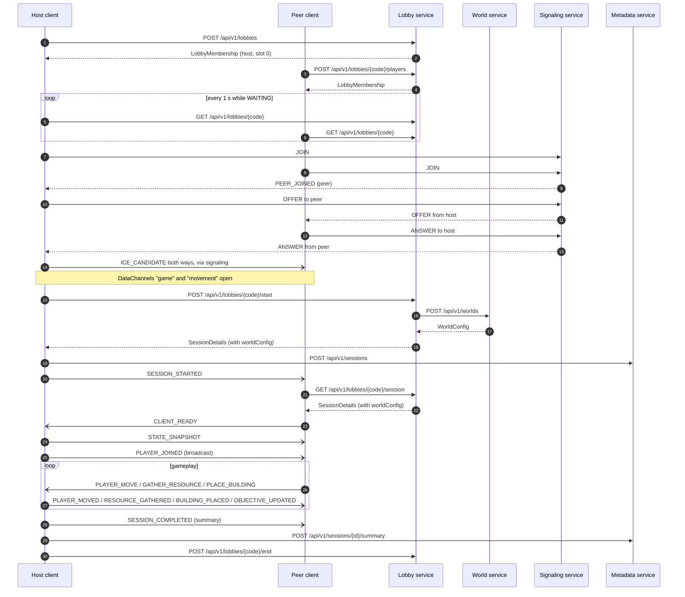

# Session flow

How a session runs from the main menu to the session-complete screen, and which contract governs
each step. The diagram is the integrated mode; the mock modes replace services with local fakes
that speak the same contracts.

## Steps

| # | Step | Contract |
|---|---|---|
| 1 | Player enters a name and creates a lobby, becoming host in slot 0 | `lobby-service.md` |
| 2 | Others join with the lobby code | `lobby-service.md` |
| 3 | Every member polls the lobby every second; the poll is also a heartbeat | `lobby-service.md` |
| 4 | Every member joins the signaling room named by the lobby code | `signaling-protocol.md` |
| 5 | The host offers a connection to each peer; peers answer | `signaling-protocol.md` |
| 6 | The host enables Start once every lobby member has an open `game` channel | `gameplay-protocol.md` |
| 7 | The host starts the session with the member IDs it is connected to; the lobby service checks them and fetches a world | `lobby-service.md`, `world-config.md` |
| 8 | The host records the session start | `metadata-service.md` |
| 9 | The host broadcasts `SESSION_STARTED`; peers fetch the session and build the world | `gameplay-protocol.md` |
| 10 | Each peer sends `CLIENT_READY` and receives `STATE_SNAPSHOT` | `gameplay-protocol.md` |
| 11 | Play: peers request, the host validates and broadcasts | `gameplay-protocol.md` |
| 12 | The last objective completes; the host broadcasts `SESSION_COMPLETED` | `gameplay-protocol.md` |
| 13 | The host posts the summary and ends the lobby; everyone sees the session-complete screen | `metadata-service.md`, `lobby-service.md` |

A solo player runs the same flow with no peers: steps 4 to 6 and 9 to 10 have nothing to do.

## Failure paths

| Situation | Who notices | What happens |
|---|---|---|
| Peer closes the tab in the lobby | Lobby service (missed heartbeats), host (signaling `PEER_LEFT`) | Peer removed after 15 s; host drops the connection |
| Peer disconnects in game | Host (channel closes) | Host broadcasts `PLAYER_LEFT`; the session continues |
| Host disconnects in game | Peers (channel closes) | Peers show "Host left" and return to the main menu; the lobby service ends the lobby with `HOST_DISCONNECTED` after 30 s without a heartbeat |
| Host ends the game | Host | Host broadcasts `SESSION_ENDED`, posts a summary with outcome `HOST_ENDED`, ends the lobby |
| Peer connection fails to open | Peer | Peer rejoins the signaling room so the host offers again; after 3 failures it shows a connection error |
| Someone joins or leaves as the host presses Start | Lobby service | Start returns 409 `LOBBY_CHANGED`; the host retries after the next poll |
| World service is down at start | Lobby service | Start returns 502 `WORLD_SERVICE_UNAVAILABLE`; the lobby stays `WAITING` |
| Metadata service is down | Host | Host logs the failure and continues. Metadata never blocks gameplay |
| Lobby service is down | Client | Integrated mode shows an error on the menu. Development modes fall back to the mock |

Host migration and reconnection are out of scope for the MVP.
